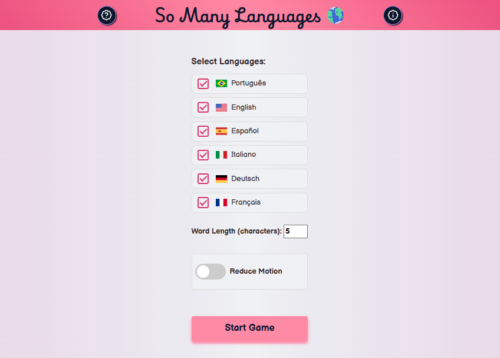
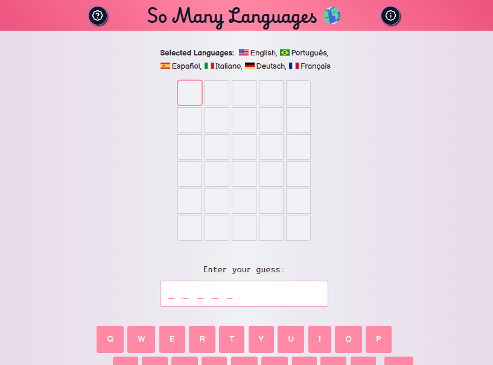

# Word Game

## Languages

This first section is in English.

[Versão em português logo abaixo.](#portuguese)

## Context

This is a solution to the Project I - Word Game (React challenge) from the [Joy of React course](https://www.joyofreact.com/).

From this challenge, I needed to:

> **Exercise 1:** Create a controlled text input component for submitting guesses
>
> **Exercise 2:** Keep track of all submitted guesses in state
>
> **Exercise 3:** Display a 5x6 grid showing all guesses with individual letter cells
>
> **Exercise 4:** Implement game logic to validate guesses and apply correct color coding
>
> **Exercise 5:** Add win/lose conditions with appropriate banner messages
>
> **Stretch Goals:** Some stretch goals, both those proposed by the instructor and personal ones

## Table of contents

- [Overview](#overview)
  - [Screenshot](#screenshot)
  - [Links](#links)
- [My process](#my-process)
  - [Built with](#built-with)
- [Author](#author)
- [More Context](#more-context)
  - [Joy of React, Project I](#joy-of-react-project-i)
  - [Getting Started](#getting-started)
  - [Exercise 1: GuessInput](#exercise-1-guessinput)
  - [Exercise 2: Keeping track of guesses](#exercise-2-keeping-track-of-guesses)
  - [Exercise 3: Guess slots](#exercise-3-guess-slots)
  - [Exercise 4: Game logic](#exercise-4-game-logic)
  - [Exercise 5: winning and losing](#exercise-5-winning-and-losing)
  - [Stretch Goals](#stretch-goals)
    - [Visual Keyboard](#visual-keyboard)
    - [Restart button](#restart-button)
  - [Personal Stretch Goals](#personal-stretch-goals)
    - [How To Play Menu](#how-to-play-menu)
    - [Credits Menu](#credits-menu)
    - [Select Languages](#select-languages)
    - [Select Word Length](#select-word-length)
    - [Words List via API](#words-list-via-api)
    - [Only Valid Words](#only-valid-words)
    - [First Row Dynamically Show Input](#first-row-dynamically-show-input)
    - [Screen Keyboard Adds Input](#screen-keyboard-adds-input)
    - [First New Input Row Can Change Input (in correct order)](#first-new-input-row-can-change-input-in-correct-order)
    - [New Color Palette](#new-color-palette)

## Overview

### Screenshot

<p align="center">
  
</p>

<p align="center">
  
</p>

### Links

- Solution URL: [GitHub Repository](https://github.com/xuaun/project-wordle)
- Live Site URL: [Live Page](https://project-wordle-eight.vercel.app/)

## My process

### Built with

- Semantic HTML5 markup
- CSS custom properties
- JavaScript & JSX
- [React](https://react.dev/learn)

## Author

- Website - [João Víctor de Araujo Lima's Portfolio](https://xuaun.github.io/)
- Frontend Mentor - [@xuaun](https://www.frontendmentor.io/profile/xuaun)

## More Context

### Joy of React, Project I

In this project, we'll recreate a popular online word game, Wordle:


In Wordle, users have 6 attempts to guess a 5-letter word. You're helped along the way by ruling out letters that aren't in the word, and being told whether the correct letters are in the correct location or not.

### Getting Started

This project is created with [Parcel](https://parceljs.org/), a modern JS build tool. It's intended to be run locally, on your computer, using Node.js and NPM.

If you're not sure how to run a local development server, or if you run into some trouble, check out the [“Local Development” instructions](https://courses.joshwcomeau.com/joy-of-react/project-wordle/03-dev-server). It includes all the info you need to know, including troubleshooting common issues.

> **NOTE: This project is tricky!**
>
> This project is meant to be challenging, because I believe that the best way to learn is to be challenged. Depending on your experience level, though, you may feel like it's unreasonably difficult.
>
> This workshop is split into 5 exercises, and each exercise has a solution video. If you spend more than 10 minutes stuck on an exercise, I encourage you to **watch the solution.** If things are still unclear after that, please ask questions in the Discord community!

### Exercise 1: GuessInput

First thing’s first: we need a way to submit guesses!

In the standard Wordle game, a global event listener registers keypresses. This isn't very accessible, and so we're going to do things a little bit differently.

We'll render a little form that holds a text input:


Your job in this first exercise is to create a new component for this UI, and render it inside the `Game` component.

Here's a minimal representation of the markup expected to be produced by this new component:

```html
<form class="guess-input-wrapper">
  <label for="guess-input">Enter guess:</label>
  <input id="guess-input" type="text" />
</form>
```

**NOTE:** This is the _minimal_ markup required, for the styles to be applied and for accessibility. **It isn't set in stone!** Feel free to make tweaks in order to match all of the acceptance criteria below.

Here's a quick screen recording of the expected result:


**Acceptance Criteria:**

- Create a new component.
  - Don't forget, you can use an NPM script to generate the scaffolding for you! We learn how to do this in the [“Getting Started” video](https://courses.joshwcomeau.com/joy-of-react/project-wordle/04-overview)
- This component should render a `<form>` tag, including a label and a text input.
- The text input should be controlled by React state.
- When the form is submitted:
  - The entered value should be logged to the console (for now).
  - The input should be reset to an empty string.
- **The user's input should be converted to ALL UPPERCASE.** No lower-case letters allowed.
- The input should have a minimum and maximum length of 5.
  - **NOTE:** The `minLength` validator is a bit funky; you may wish to use the `pattern` attribute instead. This is discussed in more detail on the [Solution page](https://courses.joshwcomeau.com/joy-of-react/project-wordle/06-solution#an-alternative-to-minlength).

### Exercise 2: Keeping track of guesses

Instead of obliterating the user's guess, let's add it to a list, so we can show the user all of their previously-submitted guesses!

For now, we aren't worrying about any game-logic stuff. We're still setting up the scaffolding, getting some of the component + DOM structure in place.

Our goal in this exercise is to render each of the user's guesses:


And here's an example of the expected DOM structure:

```html
<div class="guess-results">
  <p class="guess">FIRST</p>
  <p class="guess">GUESS</p>
</div>
```

**Acceptance Criteria:**

- A new component should be created, to render previous guesses.
- When the user submits their guess, that value should be rendered within this new component.
- There should be no key warnings in the console!

### Exercise 3: Guess slots

In the real Wordle game, the initial screen shows 6 rows of 5 squares:


In this exercise, we'll update our code to display a similar grid. We'll show 6 rows of guesses, no matter how many guesses the user has submitted, and each row will consist of 5 cells.

As the user submits guesses, their guess will populate the cells:


Here's the DOM structure you'll want to create dynamically, based on the user's guesses:

```html
<div class="guess-results">
  <p class="guess">
    <span class="cell">H</span>
    <span class="cell">E</span>
    <span class="cell">L</span>
    <span class="cell">L</span>
    <span class="cell">O</span>
  </p>
  <p class="guess">
    <span class="cell">T</span>
    <span class="cell">H</span>
    <span class="cell">E</span>
    <span class="cell">R</span>
    <span class="cell">E</span>
  </p>
  <p class="guess">
    <span class="cell">W</span>
    <span class="cell">O</span>
    <span class="cell">R</span>
    <span class="cell">L</span>
    <span class="cell">D</span>
  </p>
  <p class="guess">
    <span class="cell"></span>
    <span class="cell"></span>
    <span class="cell"></span>
    <span class="cell"></span>
    <span class="cell"></span>
  </p>
  <p class="guess">
    <span class="cell"></span>
    <span class="cell"></span>
    <span class="cell"></span>
    <span class="cell"></span>
    <span class="cell"></span>
  </p>
</div>
```

**Things to know:**

There are two things that should help you tackle this exercise:

1. You can use the `range` utility to create arrays of a specified length to map over. It's provided in `/src/utils.js`. Check out the “Range Utility” lesson in the course for more info on how to use it.
2. Inside `/src/constants.js`, you'll find a constant, `NUM_OF_GUESSES_ALLOWED`. You should import and use this constant when generating the set of guesses. This would make it easy for us to change the difficulty of the game later on, by increasing/decreasing the # of guesses.

**Acceptance Criteria:**

- Create a new `Guess` component. 6 instances should be rendered at all times, no matter how many guesses have been submitted.
- The `Guess` component should render 5 spans, each with the class of `cell`.
- Each cell should contain a letter, if the `Guess` instance has been given a value. If not, the cell should be blank.
- Use the `NUM_OF_GUESSES_ALLOWED` constant, when needed.
- No `key` warnings in the console.

### Exercise 4: Game logic

Alright: over the first 3 exercises, we've been setting up all of the structure and scaffolding. It's time to do some game-logic stuff!

In this exercise, we'll add some CSS classes to color the background of each cell, based on the results and the correct answer:


Inside `/src/game-helpers.js`, you'll find a helper function, `checkGuess`. As parameters, it takes a single guess, as well as the correct answer. It returns an array that contains the status for each letter.

For example:

```js
checkGuess("WHALE", "LEARN");
/*
  Returns:

  [
    { letter: 'W', status: 'incorrect' },
    { letter: 'H', status: 'incorrect' },
    { letter: 'A', status: 'correct' },
    { letter: 'L', status: 'misplaced' },
    { letter: 'E', status: 'misplaced' },
  ]
*/
```

There are 3 possible statuses:

- **correct** — this slot is perfect. It's the right letter in the right place.
- **misplaced** — this letter does exist in the word, but in a different slot.
- **incorrect** — this letter is not found in the word at all.

In the example above, `W` and `H` aren't found in the word `LEARN`, and so they're marked as “incorrect”. `A` is correct, since it's in the 3rd slot in each word. The other two letters, `L` and `E`, are meant to be in other slots.

**These statuses correspond with CSS classes.** The `correct` status has a `correct` class name, which will apply the green background when applied to a cell. Same thing for `misplaced` and `incorrect`.

Your task is to use this function to validate the user's guesses, and apply the correct CSS classes. The final output for a given guess should look like this:

```html
<p class="guess">
  <span class="cell incorrect">W</span>
  <span class="cell incorrect">H</span>
  <span class="cell correct">A</span>
  <span class="cell misplaced">L</span>
  <span class="cell misplaced">E</span>
</p>
```

**Acceptance Criteria:**

- Import the `checkGuess` function from `/src/game-helpers.js`, and use it to validate each of the user's guesses
- When rendering the letters in the `Guess` component, apply the letter's `status` to the `cell` element.
- "Empty" guess slots should have the same markup as before: `<span class="cell"></span>`.

### Exercise 5: winning and losing

We're so close! We only have one concern left: ending the game.

If the user wins the game, a happy banner should be shown:


If the user loses the game, by contrast, a sad banner should be shown:


The user wins the game when their guessed word is identical to the `answer`. They lose the game if they submit 6 guesses without winning.

```html
<div class="happy banner">
  <p>
    <strong>Congratulations!</strong> Got it in
    <strong>3 guesses</strong>.
  </p>
</div>
```

```html
<div class="sad banner">
  <p>Sorry, the correct answer is <strong>LEARN</strong>.</p>
</div>
```

When the game is over, one of these banners should be shown, and the text input should be disabled so that no new guesses can be typed or submitted.

**Acceptance Criteria:**

- If the user wins the game, a happy banner should be shown.
- If the user loses the game, a sad banner should be shown
- When the game is over, the text input should be disabled.
- It's up to you to decide how to structure the banner! Feel free to create new component(s) if you think it's warranted.

---

### Stretch Goals

If you're looking for an additional challenge, give these stretch goals a shot!

Unlike the standard exercises, no solution video is available for these goals, though the raw solution source code is available. See the solutions page on the Course Platform.

Also, feel free to come up with _your own_ stretch goals! If there's a thing you'd like to implement, go for it!!

### Visual Keyboard

In the real Wordle game, a keyboard is shown below the guesses:


This keyboard is an important game element, since it makes it easy to tell which letters have already been tested.

Here's what the keyboard looked like in my implementation:


**Note: Styling isn't provided for stretch goals.** You'll need to come up with your own CSS. You can add it to `src/styles.css`.

**Relatedly:** When you add a keyboard, it'll likely be pushed "below the fold" on smaller windows. Don't worry about trying to fit everything in the viewport at once.

**Acceptance Criteria:**

- Render 3 rows of letters at the bottom of the screen
- The colors of each letter should match the colors shown in the game board:
  - Correct letters should have a green background and white text
  - Misplaced letters should have a yellow background and white text
  - Incorrect letters should have a dark gray background and white text
  - Unused letters should have a light gray background and black text
- No need to include "Enter" and "Backspace" keys.
- Don't worry too much about the styling, trying to get the alignment to look exactly like a real keyboard.

### Restart button

One of Wordle's hooks is that you can only play 1 game per day: there's a new word for all users every day. As a result, there's no "restart button", you just have to wait until the next day.

In our clone, we aren't picking a new word every day, we're picking a new word when the app first loads.

Update the game so that it can be restarted. Add a "Restart game" button to the banner shown when the user wins or loses.

_HINT:_ This will require moving the `answer` into state. You'll want to do the random word selection inside a callback function, the secondary way to initialize state described here: https://courses.joshwcomeau.com/joy-of-react/02-state/03-use-state#initial-value

**Acceptance Criteria:**

- A "Restart Game" button is shown at the end of the game. You can put this button in the `GameOverBanner`, or wherever else you'd like!
- Clicking the button should select a new correct word and reset all other state.

---

## Personal Stretch Goals

### How To Play Menu

**Acceptance Criteria:**

- Display a modal or overlay explaining the game rules
- Show examples of how the color coding works (correct, misplaced, incorrect)
- Include instructions on how to submit guesses
- Add a close button to dismiss the menu

### Credits Menu

**Acceptance Criteria:**

- Display information about the original Wordle game
- Credit the Joy of React course and instructor
- Link to relevant resources and documentation
- Show personal attribution and contact information

### Select Languages

**Acceptance Criteria:**

- Implement language selection between English, Portuguese, and other Languages word lists
- Update UI text based on selected language(s)
- Persist language preference in local storage
- Maintain separate word lists for each language

### Select Word Length

**Acceptance Criteria:**

- Allow users to choose word length (e.g., 4, 5, 6 letters)
- Dynamically adjust grid size based on selected length
- Update validation to match selected word length
- Filter word list by selected length

### Words List via API

**Acceptance Criteria:**

- Fetch word list from an external API instead of local file
- Handle loading states while fetching words
- Implement error handling for failed API requests

### Only Valid Words

**Acceptance Criteria:**

- Validate submitted guesses against dictionary
- Show error message for invalid words
- Prevent submission of non-existent words
- Provide visual feedback for invalid attempts

### First Row Dynamically Show Input

**Acceptance Criteria:**

- Display letters in real-time as user types
- Update current guess row with each keystroke
- Maintain cursor position and editing capabilities
- Clear display when guess is submitted

### Screen Keyboard Adds Input

**Acceptance Criteria:**

- Clicking virtualkeyboard letters adds them to current guess
- Implement backspace functionality on virtual keyboard
- Disable used letters visually on keyboard
- Add enter key to submit guess from keyboard

### First New Input Row Can Change Input (in correct order)

**Acceptance Criteria:**

- Allow editing of current guess before submission
- Enable cursor navigation within current guess
- Support deletion and insertion at any position
- Maintain uppercase formatting during editing

### New Color Palette

**Acceptance Criteria:**

- Design and implement alternative color scheme
- Ensure sufficient contrast for accessibility
- Allow users to switch between color palettes
- Maintain color meaning (correct, misplaced, incorrect)

---

<br>

# <p id="portuguese">Jogo de palavra</p>

## Contexto

Esta é uma solução para o Projeto I - Jogo de palavra (desafio de React) do [curso Joy of React](https://www.joyofreact.com/).

A partir deste desafio, precisei:

> **Exercício 1:** Criar um componente de entrada de texto controlado para enviar palpites
>
> **Exercício 2:** Manter o controle de todos os palpites enviados no estado
>
> **Exercício 3:** Exibir uma grade 5x6 mostrando todos os palpites com células de letras individuais
>
> **Exercício 4:** Implementar lógica do jogo para validar palpites e aplicar codificação de cores correta
>
> **Exercício 5:** Adicionar condições de vitória/derrota com mensagens de banner apropriadas
>
> **Metas Extras:** Algumas metas extras, tanto as propostas pelo instrutor quanto as pessoais

## Lista de conteúdos

- [Visão Geral](#visão-geral)
  - [Prints](#prints)
  - [Links](#links-pt)
- [Meu processo](#meu-processo)
  - [Tecnologias utilizadas](#tecnologias-utilizadas)
- [Autor](#autor)
- [Mais contexto](#mais-contexto)
  - [Joy of React, Projeto I](#joy-of-react-projeto-i)
  - [Começando](#começando)
  - [Exercício 1: GuessInput](#exercício-1-guessinput)
  - [Exercício 2: Mantendo o controle dos palpites](#exercício-2-mantendo-o-controle-dos-palpites)
  - [Exercício 3: Slots de palpite](#exercício-3-slots-de-palpite)
  - [Exercício 4: Lógica do jogo](#exercício-4-lógica-do-jogo)
  - [Exercício 5: Ganhando e perdendo](#exercício-5-ganhando-e-perdendo)
  - [Metas Extras](#metas-extras)
    - [Teclado Visual](#teclado-visual)
    - [Botão de Reiniciar](#botão-de-reiniciar)
  - [Metas Extras Pessoais](#metas-extras-pessoais)
    - [Menu Como Jogar](#menu-como-jogar)
    - [Menu de Créditos](#menu-de-créditos)
    - [Selecionar Idiomas](#selecionar-idiomas)
    - [Selecionar Tamanho da Palavra](#selecionar-tamanho-da-palavra)
    - [Lista de Palavras via API](#lista-de-palavras-via-api)
    - [Apenas Palavras Válidas](#apenas-palavras-válidas)
    - [Primeira Linha Mostra Entrada Dinamicamente](#primeira-linha-mostra-entrada-dinamicamente)
    - [Teclado na Tela Adiciona Entrada](#teclado-na-tela-adiciona-entrada)
    - [Primeira Nova Linha de Entrada Pode Mudar Entrada (na ordem correta)](#primeira-nova-linha-de-entrada-pode-mudar-entrada-na-ordem-correta)
    - [Nova Paleta de Cores](#nova-paleta-de-cores)

## Visão Geral

### Print

<p align="center">
  
</p>

<p align="center">
  
</p>

### <p id="links-pt">Links</p>

- Link da Solução: [Repositório no GitHub](https://github.com/xuaun/project-wordle)
- Página funcional do jogo: [Página no ar](https://project-wordle-eight.vercel.app/)

## Meu processo

### Tecnologias utilizadas

- HTML5
- CSS
- JavaScript & JSX
- [React](https://react.dev/learn)

## Autor

- Website - [Portfólio - João Víctor de Araujo Lima](https://xuaun.github.io/)
- Frontend Mentor - [@xuaun](https://www.frontendmentor.io/profile/xuaun)

## Mais contexto

### Joy of React, Projeto I

Neste projeto, recriaremos um popular jogo de palavras online, o Wordle:


No Wordle, os usuários têm 6 tentativas para adivinhar uma palavra de 5 letras. Você é auxiliado ao longo do caminho eliminando letras que não estão na palavra e sendo informado se as letras corretas estão na posição correta ou não.

### Começando

Este projeto foi criado com [Parcel](https://parceljs.org/), uma ferramenta de build JS moderna. Ele foi projetado para ser executado localmente, no seu computador, usando Node.js e NPM.

Se você não tem certeza de como executar um servidor de desenvolvimento local, ou se encontrar algum problema, confira as instruções de ["Desenvolvimento Local"](https://courses.joshwcomeau.com/joy-of-react/project-wordle/03-dev-server). Inclui todas as informações que você precisa saber, incluindo solução de problemas comuns.

> **OBSERVAÇÃO: Este projeto é desafiador!**
>
> Este projeto foi feito para ser desafiador, porque acredito que a melhor maneira de aprender é sendo desafiado. Dependendo do seu nível de experiência, no entanto, você pode sentir que é extremamente difícil.
>
> Este workshop está dividido em 5 exercícios, e cada exercício tem um vídeo de solução. Se você passar mais de 10 minutos preso em um exercício, eu encorajo você a **assistir a solução.** Se as coisas ainda não estiverem claras depois disso, por favor faça perguntas na comunidade do Discord!

### Exercício 1: GuessInput

Começando do começo: precisamos de uma maneira de enviar palpites!

No jogo Wordle padrão, um event listener global registra toques de tecla. Isso não é muito acessível, então vamos fazer as coisas de maneira um pouco diferente.

Vamos renderizar um pequeno formulário que contém uma entrada de texto:


Seu trabalho neste primeiro exercício é criar um novo componente para esta UI e renderizá-lo dentro do componente `Game`.

Aqui está uma representação mínima da marcação esperada para ser produzida por este novo componente:

```html
<form class="guess-input-wrapper">
  <label for="guess-input">Enter guess:</label>
  <input id="guess-input" type="text" />
</form>
```

**OBSERVAÇÃO:** Esta é a marcação _mínima_ necessária, para que os estilos sejam aplicados e para acessibilidade. **Não está gravado em pedra!** Sinta-se livre para fazer ajustes para atender a todos os critérios de aceitação abaixo.

Aqui está uma gravação rápida do resultado esperado:


**Critérios de Aceitação:**

- Crie um novo componente.
  - Não esqueça, você pode usar um script NPM para gerar a estrutura para você! Aprendemos como fazer isso no vídeo ["Começando"](https://courses.joshwcomeau.com/joy-of-react/project-wordle/04-overview)
- Este componente deve renderizar uma tag `<form>`, incluindo um label e uma entrada de texto.
- A entrada de texto deve ser controlada pelo estado do React.
- Quando o formulário for enviado:
  - O valor inserido deve ser registrado no console (por enquanto).
  - A entrada deve ser redefinida para uma string vazia.
- **A entrada do usuário deve ser convertida para MAIÚSCULAS.** Nenhuma letra minúscula é permitida.
- A entrada deve ter um comprimento mínimo e máximo de 5.
  - **OBSERVAÇÃO:** O validador `minLength` é um pouco estranho; você pode desejar usar o atributo `pattern` em vez disso. Isso é discutido em mais detalhes na [página de Solução](https://courses.joshwcomeau.com/joy-of-react/project-wordle/06-solution#an-alternative-to-minlength).

### Exercício 2: Mantendo o controle dos palpites

Em vez de descartar o palpite do usuário, vamos adicioná-lo a uma lista, para que possamos mostrar ao usuário todos os seus palpites enviados anteriormente!

Por enquanto, não estamos nos preocupando com nenhuma lógica do jogo. Ainda estamos configurando a estrutura, colocando alguma estrutura de componente + DOM no lugar.

Nosso objetivo neste exercício é renderizar cada um dos palpites do usuário:


E aqui está um exemplo da estrutura DOM esperada:

```html
<div class="guess-results">
  <p class="guess">FIRST</p>
  <p class="guess">GUESS</p>
</div>
```

**Critérios de Aceitação:**

- Um novo componente deve ser criado, para renderizar palpites anteriores.
- Quando o usuário enviar seu palpite, esse valor deve ser renderizado dentro deste novo componente.
- Não deve haver avisos de chave no console!

### Exercício 3: Slots de palpite

No jogo Wordle real, a tela inicial mostra 6 linhas de 5 quadrados:


Neste exercício, atualizaremos nosso código para exibir uma grade similar. Mostraremos 6 linhas de palpites, não importa quantos palpites o usuário enviou, e cada linha consistirá em 5 células.

À medida que o usuário envia palpites, seu palpite preencherá as células:


Aqui está a estrutura DOM que você vai querer criar dinamicamente, com base nos palpites do usuário:

```html
<div class="guess-results">
  <p class="guess">
    <span class="cell">H</span>
    <span class="cell">E</span>
    <span class="cell">L</span>
    <span class="cell">L</span>
    <span class="cell">O</span>
  </p>
  <p class="guess">
    <span class="cell">T</span>
    <span class="cell">H</span>
    <span class="cell">E</span>
    <span class="cell">R</span>
    <span class="cell">E</span>
  </p>
  <p class="guess">
    <span class="cell">W</span>
    <span class="cell">O</span>
    <span class="cell">R</span>
    <span class="cell">L</span>
    <span class="cell">D</span>
  </p>
  <p class="guess">
    <span class="cell"></span>
    <span class="cell"></span>
    <span class="cell"></span>
    <span class="cell"></span>
    <span class="cell"></span>
  </p>
  <p class="guess">
    <span class="cell"></span>
    <span class="cell"></span>
    <span class="cell"></span>
    <span class="cell"></span>
    <span class="cell"></span>
  </p>
</div>
```

**Coisas para saber:**

Há duas coisas que devem ajudá-lo a enfrentar este exercício:

1. Você pode usar o utilitário `range` para criar arrays de um comprimento especificado para mapear. Ele é fornecido em `/src/utils.js`. Confira a lição "Range Utility" no curso para mais informações sobre como usá-lo.
2. Dentro de `/src/constants.js`, você encontrará uma constante, `NUM_OF_GUESSES_ALLOWED`. Você deve importar e usar esta constante ao gerar o conjunto de palpites. Isso tornaria fácil para nós mudar a dificuldade do jogo mais tarde, aumentando/diminuindo o número de palpites.

**Critérios de Aceitação:**

- Crie um novo componente `Guess`. 6 instâncias devem ser renderizadas o tempo todo, não importa quantos palpites foram enviados.
- O componente `Guess` deve renderizar 5 spans, cada um com a classe `cell`.
- Cada célula deve conter uma letra, se a instância `Guess` tiver recebido um valor. Se não, a célula deve estar em branco.
- Use a constante `NUM_OF_GUESSES_ALLOWED`, quando necessário.
- Nenhum aviso de `key` no console.

### Exercício 4: Lógica do jogo

Ao longo dos primeiros 3 exercícios, estivemos configurando toda a estrutura e esqueleto. É hora de fazer algumas coisas de lógica do jogo!

Neste exercício, adicionaremos algumas classes CSS para colorir o fundo de cada célula, com base nos resultados e na resposta correta:


Dentro de `/src/game-helpers.js`, você encontrará uma função auxiliar, `checkGuess`. Como parâmetros, ela recebe um único palpite, bem como a resposta correta. Ela retorna um array que contém o status de cada letra.

Por exemplo:

```js
checkGuess("WHALE", "LEARN");
/*
  Retorna:

  [
    { letter: 'W', status: 'incorrect' },
    { letter: 'H', status: 'incorrect' },
    { letter: 'A', status: 'correct' },
    { letter: 'L', status: 'misplaced' },
    { letter: 'E', status: 'misplaced' },
  ]
*/
```

Existem 3 status possíveis:

- **correct** — este slot está perfeito. É a letra certa no lugar certo.
- **misplaced** — esta letra existe na palavra, mas em um slot diferente.
- **incorrect** — esta letra não é encontrada na palavra.

No exemplo acima, `W` e `H` não são encontradas na palavra `LEARN`, e por isso são marcadas como "incorrect". As outras duas letras, `L` e `E`, devem estar em outros slots.

**Esses status correspondem a classes CSS.** O status `correct` tem um nome de classe `correct`, que aplicará o fundo verde quando aplicado a uma célula. O mesmo vale para `misplaced` e `incorrect`.

Sua tarefa é usar esta função para validar os palpites do usuário e aplicar as classes CSS corretas. A saída final para um determinado palpite deve ser assim:

```html
<p class="guess">
  <span class="cell incorrect">W</span>
  <span class="cell incorrect">H</span>
  <span class="cell correct">A</span>
  <span class="cell misplaced">L</span>
  <span class="cell misplaced">E</span>
</p>
```

**Critérios de Aceitação:**

- Importe a função `checkGuess` de `/src/game-helpers.js`, e use-a para validar cada um dos palpites do usuário
- Ao renderizar as letras no componente `Guess`, aplique o `status` da letra ao elemento `cell`.
- Slots de palpite "vazios" devem ter a mesma marcação de antes: `<span class="cell"></span>`.

### Exercício 5: Ganhando e perdendo

Estamos tão perto! Temos apenas uma preocupação restante: terminar o jogo.

Se o usuário ganhar o jogo, um banner feliz deve ser mostrado:


Se o usuário perder o jogo, em contraste, um banner triste deve ser mostrado:


O usuário ganha o jogo quando a palavra adivinhada é idêntica à `answer`. Eles perdem o jogo se enviarem 6 palpites sem ganhar.

```html
<div class="happy banner">
  <p>
    <strong>Congratulations!</strong> Got it in
    <strong>3 guesses</strong>.
  </p>
</div>
```

```html
<div class="sad banner">
  <p>Sorry, the correct answer is <strong>LEARN</strong>.</p>
</div>
```

Quando o jogo terminar, um desses banners deve ser mostrado, e a entrada de texto deve ser desabilitada para que nenhum novo palpite possa ser digitado ou enviado.

**Critérios de Aceitação:**

- Se o usuário ganhar o jogo, um banner feliz deve ser mostrado.
- Se o usuário perder o jogo, um banner triste deve ser mostrado
- Quando o jogo terminar, a entrada de texto deve ser desabilitada.
- Cabe a você decidir como estruturar o banner! Sinta-se livre para criar novo(s) componente(s) se achar que é justificado.

---

### Metas Extras

Se você está procurando um desafio adicional, experimente essas metas extras!

Ao contrário dos exercícios padrão, nenhum vídeo de solução está disponível para essas metas, embora o código-fonte da solução bruta esteja disponível. Veja a página de soluções na Plataforma do Curso.

Além disso, sinta-se livre para criar _suas próprias_ metas extras! Se há algo que você gostaria de implementar, vá em frente!!

### Teclado Visual

No jogo Wordle real, um teclado é mostrado abaixo dos palpites:


Este teclado é um elemento importante do jogo, pois facilita saber quais letras já foram testadas.

Aqui está como o teclado ficou na minha implementação:


**Nota: O estilo não é fornecido para metas extras.** Você precisará criar seu próprio CSS. Você pode adicioná-lo a `src/styles.css`.

**Relacionado:** Quando você adicionar um teclado, ele provavelmente será empurrado "abaixo da dobra" em janelas menores. Não se preocupe em tentar encaixar tudo na viewport de uma só vez.

**Critérios de Aceitação:**

- Renderize 3 linhas de letras na parte inferior da tela
- As cores de cada letra devem corresponder às cores mostradas no tabuleiro do jogo:
  - Letras corretas devem ter fundo verde e texto branco
  - Letras mal posicionadas devem ter fundo amarelo e texto branco
  - Letras incorretas devem ter fundo cinza escuro e texto branco
  - Letras não usadas devem ter fundo cinza claro e texto preto
- Não há necessidade de incluir as teclas "Enter" e "Backspace".
- Não se preocupe muito com o estilo, tentando fazer o alinhamento parecer exatamente como um teclado real.

### Botão de Reiniciar

Um dos ganchos do Wordle é que você pode jogar apenas 1 jogo por dia: há uma nova palavra para todos os usuários todos os dias. Como resultado, não há "botão de reiniciar", você só precisa esperar até o dia seguinte.

No nosso clone, não estamos escolhendo uma nova palavra todos os dias, estamos escolhendo uma nova palavra quando o aplicativo é carregado pela primeira vez.

Atualize o jogo para que possa ser reiniciado. Adicione um botão "Reiniciar jogo" ao banner mostrado quando o usuário ganha ou perde.

_DICA:_ Isso exigirá mover a `answer` para o estado. Você vai querer fazer a seleção de palavra aleatória dentro de uma função de callback, a maneira secundária de inicializar o estado descrita aqui: https://courses.joshwcomeau.com/joy-of-react/02-state/03/use-state#initial-value

**Critérios de Aceitação:**

- Um botão "Reiniciar Jogo" é mostrado no final do jogo. Você pode colocar este botão no `GameOverBanner`, ou onde mais você quiser!
- Clicar no botão deve selecionar uma nova palavra correta e redefinir todo o outro estado.

---

// ...existing code...

## Metas Extras Pessoais

### Menu Como Jogar

**Critérios de Aceitação:**

- Exibir um modal ou overlay explicando as regras do jogo
- Mostrar exemplos de como funciona a codificação de cores (correto, mal posicionado, incorreto)
- Incluir instruções sobre como enviar palpites
- Adicionar um botão de fechar para dispensar o menu

### Menu de Créditos

**Critérios de Aceitação:**

- Exibir informações sobre o jogo Wordle original
- Creditar o curso Joy of React e o instrutor
- Linkar recursos e documentação relevantes
- Mostrar atribuição pessoal e informações de contato

### Selecionar Idiomas

**Critérios de Aceitação:**

- Implementar seleção de idioma entre listas de palavras em Inglês, Português e outros idiomas
- Atualizar texto da UI com base no(s) idioma(s) selecionado(s)
- Persistir preferência de idioma no local storage
- Manter listas de palavras separadas para cada idioma

### Selecionar Tamanho da Palavra

**Critérios de Aceitação:**

- Permitir que os usuários escolham o tamanho da palavra (por exemplo, 4, 5, 6 letras)
- Ajustar dinamicamente o tamanho da grade com base no tamanho selecionado
- Atualizar validação para corresponder ao tamanho da palavra selecionado
- Filtrar lista de palavras por tamanho selecionado

### Lista de Palavras via API

**Critérios de Aceitação:**

- Buscar lista de palavras de uma API externa em vez de arquivo local
- Lidar com estados de carregamento enquanto busca palavras
- Implementar tratamento de erros para requisições de API com falha

### Apenas Palavras Válidas

**Critérios de Aceitação:**

- Validar palpites enviados contra dicionário
- Mostrar mensagem de erro para palavras inválidas
- Prevenir envio de palavras inexistentes
- Fornecer feedback visual para tentativas inválidas

### Primeira Linha Mostra Entrada Dinamicamente

**Critérios de Aceitação:**

- Exibir letras em tempo real conforme o usuário digita
- Atualizar linha de palpite atual com cada tecla pressionada
- Manter posição do cursor e capacidades de edição
- Limpar exibição quando o palpite for enviado

### Teclado na Tela Adiciona Entrada

**Critérios de Aceitação:**

- Clicar nas letras do teclado virtual as adiciona ao palpite atual
- Implementar funcionalidade de backspace no teclado virtual
- Desabilitar letras usadas visualmente no teclado
- Adicionar tecla enter para enviar palpite do teclado

### Primeira Nova Linha de Entrada Pode Mudar Entrada (na ordem correta)

**Critérios de Aceitação:**

- Permitir edição do palpite atual antes do envio
- Habilitar navegação do cursor dentro do palpite atual
- Suportar deleção e inserção em qualquer posição
- Manter formatação em maiúsculas durante a edição

### Nova Paleta de Cores

**Critérios de Aceitação:**

- Projetar e implementar esquema de cores alternativo
- Garantir contraste suficiente para acessibilidade
- Permitir que os usuários alternem entre paletas de cores
- Manter significado das cores (correto, mal posicionado, incorreto)
